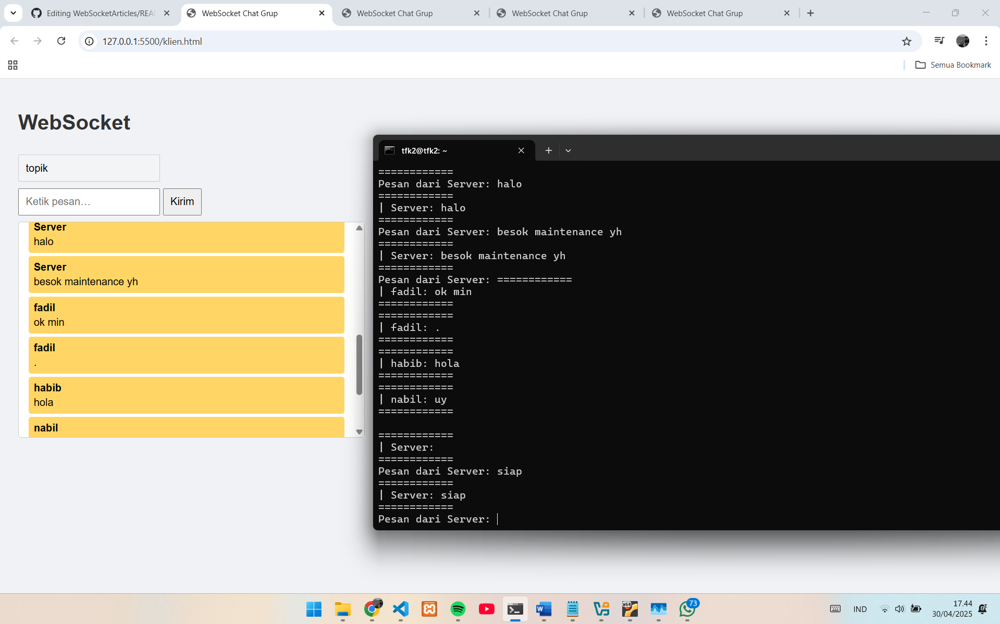

# WebSocketExperimen
| UTS |  Pemrograman Web 2  
|-------|---------
| NIM   | 312310576
| Nama  | Taufik Hidayat
| Kelas | TI.23.A6
| Dosen |  Agung Nugroho, S.Kom., M.Kom.


### Eksperimen Node.js dengan Virtual Machine Ubuntu

Struktur eksperimen menggunakan Node.js dengan server.js dan client.js yang dijalankan pada Ubuntu Virtual Machine.

### Persiapan
#### Download dan Install VirtualBox

1. Download VirtualBox dari situs resmi: https://www.virtualbox.org/wiki/Downloads
2. Install VirtualBox sesuai dengan sistem operasi yang Anda gunakan

#### Download Ubuntu
Download Ubuntu Desktop dari situs resmi: https://ubuntu.com/download/desktop

### Instalasi Node.js di Ubuntu
```
sudo apt update
sudo apt install nodejs
sudo apt install npm
```

### Struktur Eksperimen
#### 1. Buat file server.js
```
const WebSocket = require('ws');
const readline = require('readline');

const server = new WebSocket.Server({ host: '192.168.1.26', port: 8080 });
const clients = new Set();

console.log('Menunggu koneksi dari klien...');

server.on('connection', socket => {
  clients.add(socket);
  console.log('Client connected');

  socket.on('message', message => {
    try {
    
      const data = JSON.parse(message);
      console.log('============');
      console.log(`| ${data.username}: ${data.message}`);
      console.log('============');

     
      broadcast(JSON.stringify({
        username: data.username,
        message: data.message
      }));
    } catch (err) {
      console.log('Pesan tidak valid dari client');
    }
  });

  socket.on('close', () => {
    clients.delete(socket);
    console.log('Client disconnected');
  });
});

function broadcast(message) {
  for (const client of clients) {
    if (client.readyState === WebSocket.OPEN) {
      client.send(message);
    }
  }
}


const rl = readline.createInterface({
  input: process.stdin,
  output: process.stdout
});

function promptServerMessage() {
  rl.question('Pesan dari Server: ', (msg) => {
    const data = JSON.stringify({
      username: 'Server',
      message: msg
    });

    broadcast(data);

    console.log('============');
    console.log(`| Server: ${msg}`);
    console.log('============');

    promptServerMessage();
  });
}

promptServerMessage();
```
#### 2. Buat file client.js
```
<!DOCTYPE html>
<html lang="id">
<head>
  <meta charset="UTF-8" />
  <title>WebSocket Chat Grup</title>
</head>
<body>
  <h1>WebSocket</h1>
  <input id="username" type="text" placeholder="Masukkan username..." />
  <br />
  <input id="input" type="text" placeholder="Ketik pesan…" disabled />
  <button onclick="sendMessage()" disabled id="sendBtn">Kirim</button>

  <div id="chat-box">
    <ul id="messages"></ul>
  </div>

  <script>
    let username = '';
    const socket = new WebSocket("ws://192.168.1.26:3306");
    const input = document.getElementById('input');
    const usernameInput = document.getElementById('username');
    const sendBtn = document.getElementById('sendBtn');
    const messages = document.getElementById('messages');

    socket.onopen = () => {
      addStatusMessage('Terhubung ke server! Silakan masukkan username.');
    };

    socket.onmessage = event => {
      const data = JSON.parse(event.data);
      const li = document.createElement('li');

      if (data.username === username) {
        li.className = 'client-msg';
      } else {
        li.className = 'other-msg';
      }

      li.innerHTML = `<span class="username">${data.username}</span>${data.message}`;
      messages.appendChild(li);
    };

    usernameInput.addEventListener('change', () => {
      const name = usernameInput.value.trim();
      if (name !== '') {
        username = name;
        input.disabled = false;
        sendBtn.disabled = false;
        usernameInput.disabled = true;
        addStatusMessage(`Kamu login sebagai ${username}`);
      }
    });

    function sendMessage() {
      const text = input.value.trim();
      if (text !== '' && username !== '') {
        const data = {
          username: username,
          message: text
        };
        socket.send(JSON.stringify(data));
        input.value = '';
      }
    }

    function addStatusMessage(text) {
      const li = document.createElement('li');
      li.textContent = text;
      li.className = 'status-msg';
      messages.appendChild(li);
    }
  </script>
</body>
</html>
```

### Pengujian

Jalankan server.js di VM Ubuntu

#### Di VirtualBox ubuntu
```
node server.js
```

#### Bisa di jalankan di terminal VScode atau os yg lain

Jalankan client.js dari komputer lain di jaringan yang sama

### Hasil



#### References

- [DigitalOcean. (2024, Oktober 30).](https://www.digitalocean.com/community/tutorials/how-to-install-node-js-on-ubuntu-22-04)
- [DataFlair. (2018, September 20).](https://data-flair.training/blogs/install-ubuntu-on-virtualbox/)
- [Node.js. (2025, Maret 9).](https://nodejs.org/en/learn/getting-started/introduction-to-nodejs)
- [Hostinger. (n.d.)](https://www.hostinger.com/id/tutorial/install-node-js-ubuntu)


