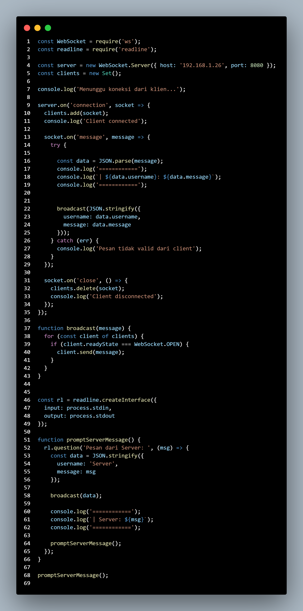
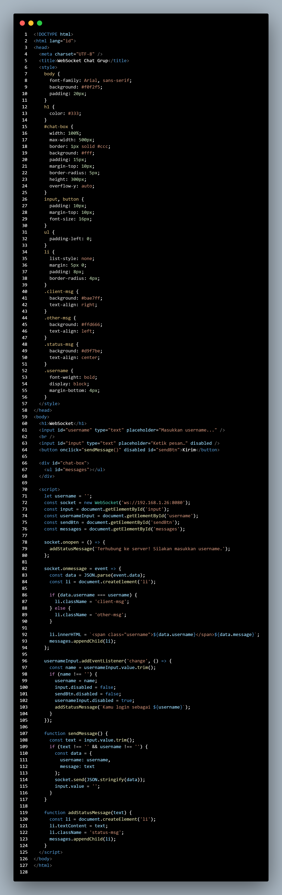

# WebSocketArticles
| UTS |  Pemrograman Web 2  
|-------|---------
| NIM   | 312310576
| Nama  | Taufik Hidayat
| Kelas | TI.23.A6
| Dosen |  Agung Nugroho, S.Kom., M.Kom.
| Link Artikel | https://medium.com/@tfkhdyt18/websocket-effective-communication-in-real-time-for-contemporary-applications-83a494e5d4cd |

### Pendahuluan
Kebutuhan akan aplikasi yang dapat berkomunikasi secara instan dan interaktif meningkat sebagai akibat dari kemajuan teknologi web. Untuk aplikasi real-time seperti chat, game online, dan notifikasi, model komunikasi tradisional berbasis HTTP yang menggunakan pendekatan request-response mulai terasa kurang efisien. Ini adalah tempat teknologi WebSocket muncul sebagai protokol komunikasi yang memungkinkan pertukaran data dua arah yang berkelanjutan dan langsung. Konsep WebSocket, perbedaan dengan HTTP konvensional, dan contoh implementasi sederhana dibahas dalam artikel ini.

### PEMBAHASAN
Apa itu WebSocket?
WebSocket adalah protokol komunikasi yang menggunakan koneksi TCP full-duplex antara klien dan server. Ini memungkinkan data dikirim dan diterima secara bersamaan dan berkelanjutan tanpa harus membuka koneksi baru setiap kali bertukar data. Ini berbeda dengan HTTP konvensional, yang memungkinkan interaksi data dalam waktu nyata dengan latensi rendah.

Bagaimana WebSocket berbeda dengan HTTP tradisional? HTTP tradisional menggunakan model request-response di mana klien mengirim permintaan dan server memberikan respons, kemudian koneksi ditutup. Ini menyebabkan overhead dan latensi yang lebih tinggi karena koneksi harus dibuka dan ditutup berulang kali. Sebaliknya, WebSocket memiliki koneksi yang tetap dibuka, yang memungkinkan pertukaran data yang efisien dan cepat tanpa overhead berulang. Ini membuatnya ideal untuk aplikasi yang memerlukan komunikasi interaktif antara klien dan server.
Kasus: Jika Anda menggunakan aplikasi chat online WebSocket, Anda dapat mengirim dan menerima pesan secara instan tanpa perlu refresh halaman.
Game Online: Memungkinkan Anda berinteraksi dengan pemain lain dan mengikuti perubahan status game secara real-time.
Notifikasi Real-Time: Memberikan pemberitahuan kepada pengguna secara real-time.
Live Data Feed: Misalnya, data pasar saham atau sensor Internet of Things yang perlu diupdate secara terus menerus
Kolaborasi Dokumen Online: Memungkinkan pengguna menyinkronkan perubahan dokumen secara bersamaan.

### Implementasi sederhana
Aplikasi chat real-time menggunakan Node.js dengan VirtualBox ubuntu VM sebagai server dan html+JavaScript pada klien. Saat klien terhubung, koneksi WebSocket terbuka. Ini memungkinkan komunikasi real-time yang lancar karena pesan dapat dikirim dan diterima secara instan tanpa melakukan permintaan HTTP berulang.
Kesimpulan
WebSocket menjadi teknologi penting untuk mendukung aplikasi web modern yang membutuhkan komunikasi real-time dengan latensi rendah dan efisiensi tinggi. Dengan perbedaan dasar dari HTTP tradisional, WebSocket memungkinkan pengalaman pengguna yang lebih interaktif dan responsif, terutama untuk aplikasi chat, game, notifikasi, dan feed data live. Selain itu, kemudahan implementasinya memberi pengembang banyak peluang untuk membuat produk digital yang lebih dinamis.

- Server.js

- Client.html

- Cuplikan

### References
- Fette dan Melnikov (2011). Protokol WebSocket. RFC 6455 dapat ditemukan di sini: https://tools.ietf.org/html/rfc6455

- WebSockets dapat ditemukan di MDN Web Docs di https://developer.mozilla.org/en-US/docs/Web/API/WebSockets_API.

- Node.js ws Library dapat ditemukan di Perpustakaan GitHub berikut: https://github.com/websockets/ws

- Standar HTML Living: WebSocket WHATWG dapat ditemukan di sini: https://html.spec.whatwg.org/multipage/web-sockets.html.

- Tutorial WebSocket dari TutorialsPoint dapat ditemukan di sini: https://www.tutorialspoint.com/websockets/index.htm.
